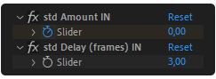

# Effects Controls

When you create a **Text Delay**, 2 effect controls will be added to the layer:

- **AMOUNT**: The amount of effect applied to the text. This is where the keyframes go. The effect is connected to the amount property of the Expression selector, so it's the same thing, but easier to access and animate.

?> Play with the keyframes and curves to change the animation, like adding some spring or bounce. You can use the [linear easing](/interface?id=options) and apply other easings with **DUIK** and **Ease'n'Wizz** for example.

- **DELAY**: The delay, in frames. The value that is on the [delay textfield](/interface?id=options).

Note that both controls will be named properly, based on the animation type. Like "std Amount OUT" or "std Delay IN". No suffix if the animation type is both IN and OUT.

If you want to save a preset out of this animation, you must also select this 2 controls. The [Save Preset utility](/interface?id=utilities) will help to automate this task.