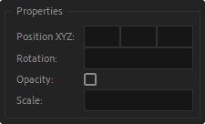
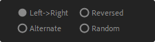

# Interface
Let's go through all the sections of the UI, including tips, thoughts and restrictions.

## Animation Type
Activate IN, OUT or both animations. This will create keyframes based on in and out points of the layers regardless where the timeline pointer is.

?> When OUT is enabled, the script will extend the layer outpoint to acommodate the delayed text and don't cut off the animation.

The dropdown list will change the "Based On" property, inside the Expression Selector ('Characters with no spacing' was ommitted for the sake of simplicity).

## Properties
The most basic and used properties are supported in the script interface. For now, any other property may be added after creating the delay, right in the Expression Selector as usual.

You may enter the values in the fields, the script will add just the properties that were changed. Alternatively, you can use the [Sampler utility](/interface?id=utilities) to retrieve values from other Simple Text Delay text animator.

- **Position XYZ**: 3 fields in that same order XYZ. If Z value is set, the text layer option "Enable Per-character 3D" will be activated.

- **Rotation**: Set the rotation, in degrees.
- **Opacity**: Turn opacity on / off. When on, it assumes that the opacity is *0* which cover the most cases. For other opacity value, you may turn on the checkbox and change after creating the delay.
- **Scale**: Set the value for scale, which will be applied to Scale X and Scale Y.

?> To reset the values in a property, double click on the property label.

?> If you need different values for IN and OUT animation, you can create two delays separately. They will add together in the final animation.

## Options
These are the heart of text animation, we all know them well. 

Check it out:

- **EASING**: There are 4 types of preset easings for now:
    <table>
  <tr>
    <td><strong>Start Fast</strong></td>
    <td>Ease in the end, more common for IN transitions. The curve influence is 20 / 60.</td>
    <td></td>
  </tr>
  <tr>
    <td width="120px"><strong>Ease In Out</strong></td>
    <td>Ease both ends with an influence of 60 / 60.</td>
    <td></td>
  </tr>
  <tr>
    <td><strong>Linear</strong></td>
    <td>No easing. If you want to apply some other fancy easings with <strong>DUIK</strong> or <strong>Ease'n'Wizz</strong> for example, this is the way to go.</td>
    <td></td>
  </tr>
  <tr>
    <td><strong>End Fast</strong></td>
    <td>Start slow, more common to OUT transitions.  The curve influence is 60 / 15.</td>
    <td></td>
  </tr>
  
</table>
   
- **DURATION**: Duration of IN / OUT animation, in seconds, 
defining where keyframes will be created. **Defaults to 0.8s** if there's no input.

- **DELAY**: The delay per character, words or lines, in frames. A positive floating number. **Defaults to 3** if there's no input.

## Direction
Here you can choose in what direction your text will animate.

This is also where the expressions come into play. Each type has a simple expression, no more than 5 lines. The code is clear and commented so you can check and modify as you will.

These are the options for direction:

- **Left -> Right**: The good old 'from left to right'.
- **Reversed**: From right to left, very usefull for languages like Arabic or Hebrew. Also when the animation come from the left, the words may overlap, so just go with "Reversed".
- **Alternate**: Invert the property value every other index so the amount will alternate between 100% and -100%.
- **Random**: Apply the delay randomly. The random seed is based on the layer index.

!> When using **"Alternate"**, keep in mind that the opacity property doesn't accept -100 as a value. If you want to use both "Alternate" and "Opacity", first apply the other properties with "Alternate" direction and then apply just the "Opacity" with the "Left -> Right" or "Reversed" direction.

## Create

After setting the basic properties and selecting your text layers, click **"Create"**.

?> **Photoshop text layers** are also acceptable. The script will try to convert them into AE text layers. Be sure to select JUST text layers. If you have any other type of Photoshop layer among the selection, none PS layer will be converted and the delay will be applied just to AE text layers.

Hold modifier keys to add other actions:

ALT + click :**Remove all animators and effect controls** created by Simple Text Delay, before adding the new ones. It's handy when you want to tweak and overwrite some options during the creation.

SHIFT + click :**Normalize all text selected** before applying the delay. Normalize means setting the scale to 100% and changing the font size accordingly so the overall size don't change. It's very useful, specially for Photoshop text layers, that come into After Effects in many different scales. This option is also great for keeping the overall motion identity, as the text animation properties are affected by the layer scale.

!> When normalizing, the text style of the first character will be applied to the whole text, meaning that you will loose all additional styles in that particular layer, like different font face, size, color, etc. Use it wisely.

## Utilities & Settings

Some helpers that wanna be the icing on the cake.

- **Sampler**: It will retrieve all information of a "Simple Text Delay layer" and populate the interface accordingly.
It can find IN/OUT animation type, properties, duration, delay, even the direction. Just select the layer and click. It runs on the first selected layer, so every other selected layer will be ignored.

- **Save Preset**: Shortcut for selecting Simple Text Delay properties, effect controls and other important text properties like "Path" and "More Options", so you can save as an animation preset.   SHIFT + click : Additionally, you can open the "Save animation preset" window, if holding the shift key.

- **Settings**: 
  Follow the gear icon to:
  1. Check the **version** of the script.
  2. Verify or deactivate your license. More information about [Licensing here](/getting_started?id=licensing).
  3. Email for **support and feedbacks**! <tilles80@gmail.com>
  4. If you're into **motion & coding**, follow my [Instagram](http://www.instagram.com/tilles.motioncode ":target=_blank") and [Youtube](http://www.youtube.com/TillesMotion ":target=_blank"), for content and freebies about scripting, expressions and presets for After Effects.
